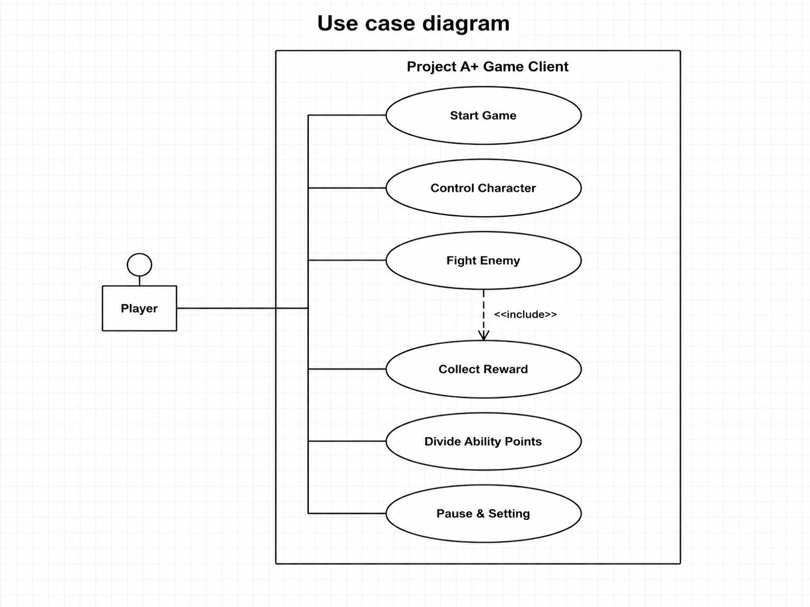
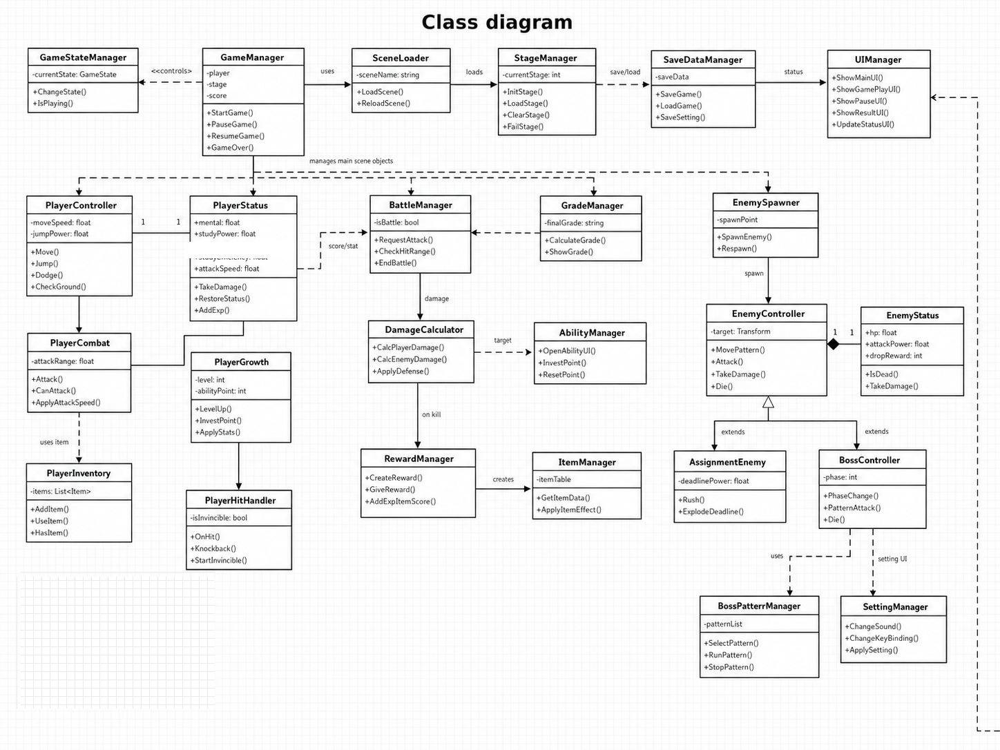
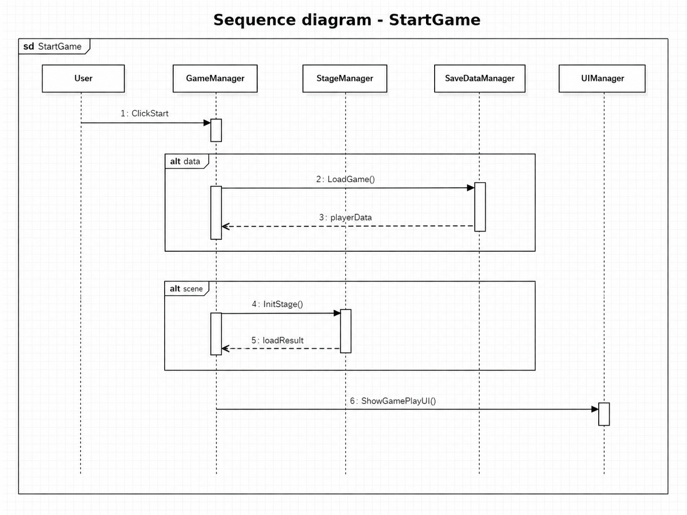
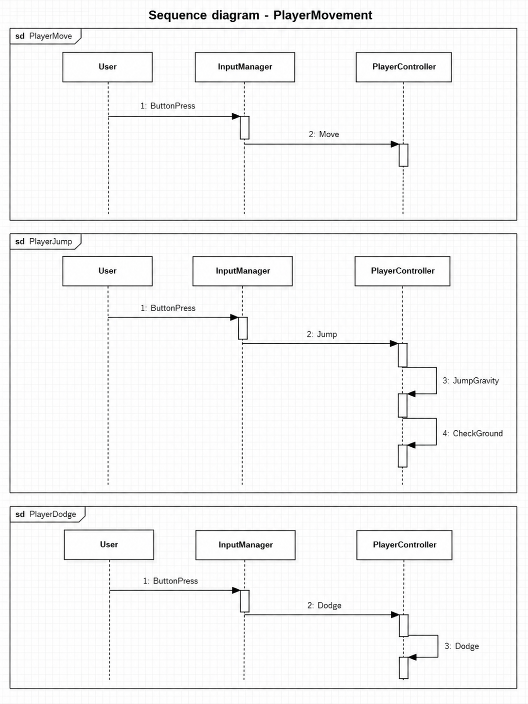
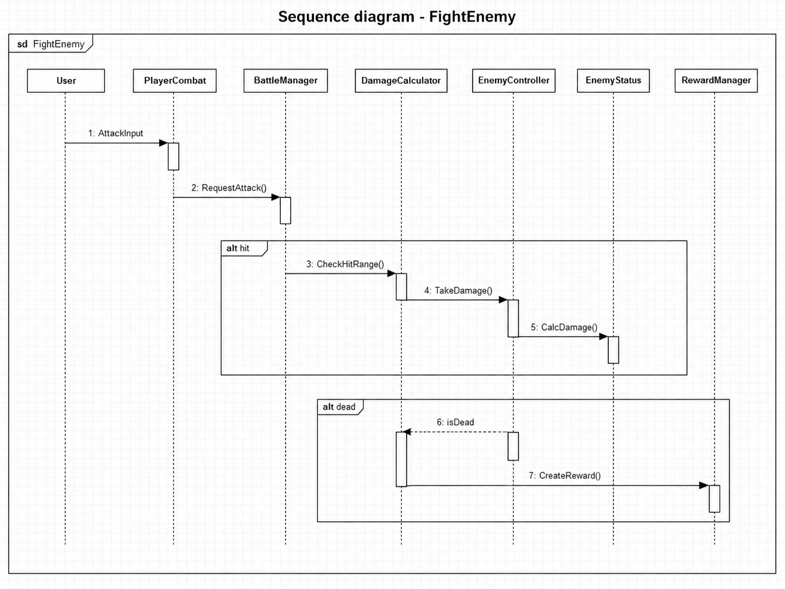
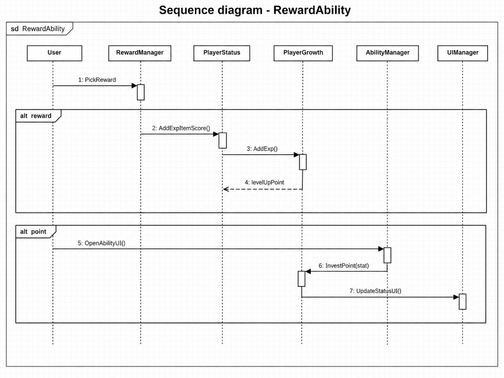
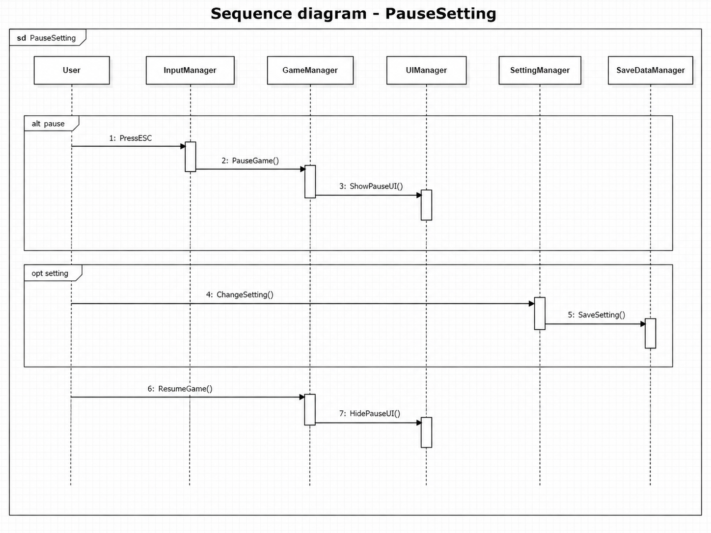
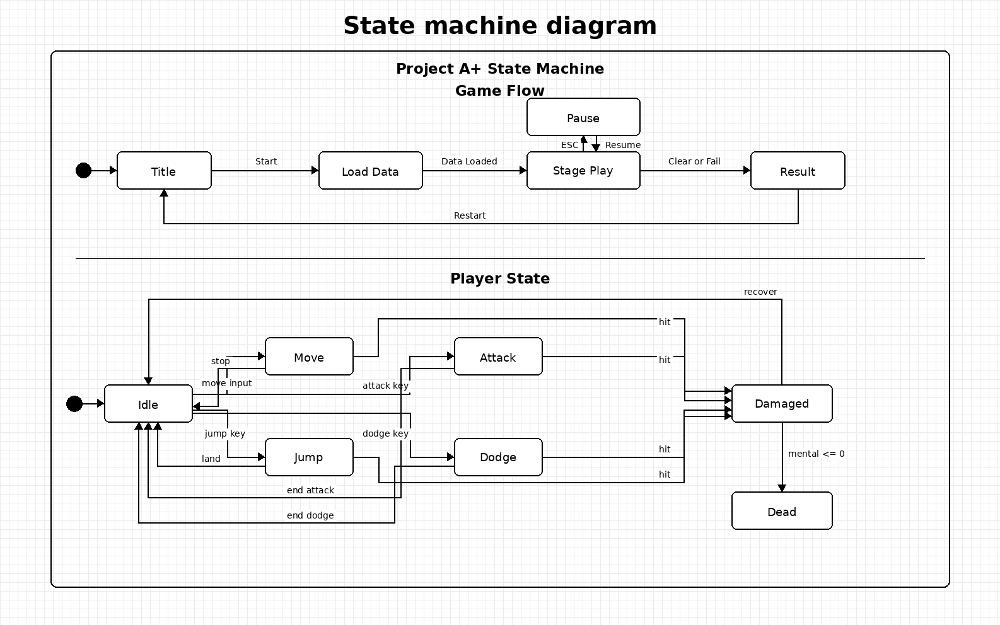

# Project A+ Design Phase

**2D Action Platformer Game Design Document**

---

## Revision history

| Revision date | Version # | Description | Author |
|---|---:|---|---|
| 2026-06-01 | 0.1 | First document | 류재민 |
| 2026-06-04 | 0.2 | Revised UML diagrams with orthogonal routing and no overlaps | 류재민 |
| 2026-06-05 | 1.0 | fix | 류재민 |

---

## Contents

1. Introduction  
2. Class diagram  
3. Sequence diagram  
4. State machine diagram  
5. Implementation requirements  
6. Glossary  
7. References  

---

# 1. Introduction

## 1. Summary

현대의 대학생은 한 학기 동안 출석, 과제, 팀플, 시험, 성적 압박과 같은 여러 문제를 동시에 해결해야 한다. **Project A+**는 이러한 학업 과정을 2D 액션 플랫포머 게임으로 재해석한 프로젝트이다. 플레이어는 한 명의 대학생 캐릭터가 되어 스테이지를 진행하고, 과제 몬스터와 시험 보스를 상대하며, 보상과 성장 포인트를 통해 능력치를 강화한다.

본 게임의 핵심 재미는 단순한 이동과 전투가 아니라 대학 생활의 스트레스를 게임 규칙으로 변환하는 데 있다. 멘탈은 체력, 공부량은 기본 공격력, 복습은 추가 공격 성능, 공격 효율은 공격 간격을 줄여 전투 템포를 빠르게 만드는 스탯을 의미한다. 이러한 스탯은 플레이어가 스테이지를 진행하면서 성장하고 최종적으로 A+라는 목표에 도달하도록 돕는다.

## 2. Introduce "Project A+"

Project A+는 Unity 기반의 2D 액션 플랫포머 게임이다. 플레이어는 수업 주차를 상징하는 스테이지를 순서대로 진행하며, 일반 적, 과제 몬스터, 중간고사 보스, 기말고사 보스를 상대한다. 각 스테이지는 이동, 점프, 회피, 공격, 아이템 사용, 능력치 투자와 같은 기본 조작을 중심으로 설계된다.

게임 구조는 GameManager가 전체 흐름을 제어하고, StageManager가 스테이지를 로드하며, PlayerController와 PlayerCombat이 조작 및 전투를 처리하는 방식으로 구성된다. EnemyController와 BossController는 적 행동과 보스 패턴을 담당하고, RewardManager와 AbilityManager는 보상 및 성장 시스템을 담당한다. UIManager는 플레이 화면, 일시정지 화면, 결과 화면, 능력치 화면을 표시한다.

## 3. Goal

이번 Design 보고서에서는 Project A+의 주요 클래스 구조와 객체 간 관계를 **Class Diagram**으로 정리하고, 핵심 Use case에 대해 **Sequence Diagram**을 작성하여 동작 과정을 설명한다. 또한 게임이 완성되었을 때 발생할 수 있는 전체 게임 흐름과 플레이어 상태 변화를 **StateMachine Diagram**으로 표현한다.

해당 보고서를 읽고 나면 Project A+가 어떤 클래스 구조를 기반으로 구현되는지, 게임 시작부터 전투, 보상, 능력치 분배, 일시정지 및 설정까지의 흐름이 어떻게 연결되는지 이해할 수 있다. 최종적으로 본 문서는 구현 단계에서 필요한 클래스 책임, 데이터 흐름, 상태 전이, 예외 처리 기준을 제공하는 것을 목표로 한다.

---

## Use case overview

아래 Use case diagram은 Project A+의 핵심 플레이 흐름을 요약한다. 사용자는 게임 시작, 캐릭터 조작, 전투, 보상 획득, 능력치 분배, 일시정지 및 설정 기능을 수행한다. Fight Enemy 과정에서 적 처치가 발생하면 Collect Reward가 포함된다.

---

# 2. Class diagram

해당 프로젝트는 Unity를 사용하여 진행하는 2D 액션 플랫포머이다. Unity에서는 각 기능이 GameObject에 부착되는 Component 형태로 동작하기 때문에, 본 설계에서는 상속 중심 구조보다 역할별 컴포넌트 분리를 우선하였다. 대부분의 실행 클래스는 MonoBehaviour를 기반으로 동작하며, Start, Update, Trigger, Collision 이벤트를 통해 게임 오브젝트와 상호작용한다.

아래 클래스 다이어그램은 메인 게임 씬에서 사용되는 핵심 클래스 25개를 중심으로 표현한 것이다. 실제 구현에서는 UI 세부 버튼, 이펙트, 사운드, 개별 아이템 데이터 등 더 많은 보조 클래스가 사용될 수 있으나, 본 Design Phase에서는 게임 흐름과 직접 연결되는 핵심 클래스만 포함하였다.

## Core system

| Class | Description |
|---|---|
| GameManager | 게임 전체 흐름을 제어하는 중심 클래스이다. StartGame(), PauseGame(), ResumeGame(), GameOver()를 통해 플레이 상태를 전환한다. |
| GameStateManager | Title, Play, Pause, Result와 같은 게임 상태를 관리한다. 현재 상태에 따라 입력, UI, 시간 흐름을 제어한다. |
| SceneLoader | 타이틀, 스테이지, 결과 화면 등 씬 전환을 담당한다. 스테이지 재시작과 결과 화면 이동에도 사용된다. |
| StageManager | 스테이지 초기화, 로드, 클리어, 실패 처리를 담당한다. 현재 주차 또는 시험 스테이지 정보를 관리한다. |
| SaveDataManager | 플레이어 진행 상황, 설정값, 최고 점수, 클리어 여부를 저장하고 불러온다. |
| UIManager | 타이틀, 게임 플레이 HUD, 일시정지, 능력치, 결과 화면을 표시하고 갱신한다. |

## Player

| Class | Description |
|---|---|
| PlayerController | 입력에 따라 이동, 점프, 회피를 수행한다. CheckGround()를 통해 점프 후 착지 여부를 확인한다. |
| PlayerStatus | 멘탈, 공부량, 복습, 공격 효율, 집중력, 경험치, 점수를 관리한다. |
| PlayerCombat | 플레이어의 공격 입력, 공격 가능 여부, 공격 효율 적용을 처리한다. |
| PlayerGrowth | 경험치 누적, 레벨업, 성장 포인트 지급 및 능력치 적용을 담당한다. |
| PlayerInventory | 획득한 아이템을 보관하고 사용 가능 여부를 확인한다. |
| PlayerHitHandler | 피격 처리, 넉백, 짧은 무적 시간 적용을 담당한다. |

## Battle, reward, and enemy

| Class | Description |
|---|---|
| BattleManager | 전투 요청을 받고 공격 범위와 충돌 결과를 확인한다. |
| DamageCalculator | 공부량, 복습, 방어력, 적 스탯을 기반으로 최종 데미지를 계산한다. |
| RewardManager | 적 처치나 스테이지 클리어 시 경험치, 점수, 아이템 보상을 생성하고 지급한다. |
| ItemManager | 아이템 데이터와 아이템 효과를 관리한다. 회복형, 강화형, 점수형 아이템을 처리한다. |
| AbilityManager | 능력치 분배 UI를 열고 성장 포인트를 특정 스탯에 투자한다. |
| GradeManager | 클리어 시간, 남은 멘탈, 점수, 보스 클리어 여부를 종합하여 최종 성적을 계산한다. |

| Class | Description |
|---|---|
| EnemySpawner | 스테이지에 적을 생성하고 필요한 경우 재생성한다. |
| EnemyController | 일반 적의 이동, 공격, 피격, 사망 처리를 담당한다. |
| EnemyStatus | 적 체력, 공격력, 방어력, 보상 정보를 관리한다. |
| AssignmentEnemy | 과제 몬스터 전용 클래스이다. 돌진, 제출기한 폭발 등 특수 행동을 가진다. |
| BossController | 보스의 페이즈, 패턴 공격, 사망 처리를 담당한다. 중간고사와 기말고사 보스에 사용된다. |
| BossPatternManager | 보스 패턴 목록에서 현재 상황에 맞는 공격 패턴을 선택하고 실행한다. |
| SettingManager | 사운드, 조작키, 화면 설정을 변경하고 SaveDataManager에 저장한다. |

---

# 3. Sequence diagram

Sequence Diagram은 Use case가 실행될 때 객체들이 어떤 순서로 메시지를 주고받는지 나타낸다. 본 문서에서는 게임 진행에 필요한 핵심 흐름인 Start Game, Player Movement, Fight Enemy, Reward and Ability, Pause and Setting을 중심으로 작성하였다. 각 다이어그램은 sd 프레임, lifeline, activation bar, alt/opt frame을 사용하여 표현하였다.

## 1) Start Game

Start Game Use case는 플레이어가 시작 버튼을 누르는 순간 시작된다. GameManager는 SaveDataManager를 통해 저장 데이터를 확인하고, StageManager에 현재 스테이지 초기화를 요청한다. 스테이지 로드가 완료되면 UIManager가 게임 플레이 UI를 표시한다.

## 2,3,4) Player Movement

Player Movement는 Move, Jump, Dodge로 구분된다. 일반적인 순서는 User가 버튼을 입력하면 InputManager가 입력을 해석하고 PlayerController가 실제 행동을 수행하는 방식이다. Jump의 경우 점프 중 중력 적용과 착지 확인이 필요하므로 JumpGravity와 CheckGround가 추가된다.

## 5) Fight Enemy

Fight Enemy Use case에서는 User의 공격 입력이 PlayerCombat으로 전달되고, BattleManager가 공격 범위를 확인한다. 공격이 적에게 닿으면 EnemyController와 EnemyStatus가 피해 처리를 수행하고, DamageCalculator가 최종 데미지를 계산한다. 적이 사망하면 RewardManager가 보상을 생성한다.

## 6) Collect Reward & Divide Ability Points

RewardAbility Use case는 적 처치 또는 스테이지 클리어 후 실행된다. RewardManager는 경험치, 아이템, 점수를 PlayerStatus에 반영하고, PlayerGrowth는 경험치 누적 및 레벨업 여부를 확인한다. 이후 AbilityManager가 성장 포인트 투자를 처리하고 UIManager가 상태 UI를 갱신한다.

## 7) Pause & Setting

Pause & Setting Use case는 ESC 입력으로 시작된다. InputManager가 입력을 감지하면 GameManager가 게임을 일시정지하고 UIManager가 Pause UI를 표시한다. 설정 변경이 발생하면 SettingManager가 값을 적용하고 SaveDataManager가 설정을 저장한다. 이후 ResumeGame이 호출되면 게임은 다시 Stage Play 상태로 돌아간다.

---

# 4. State machine diagram

StateMachine Diagram은 게임 전체 흐름과 플레이어의 행동 상태가 어떤 조건에 의해 전이되는지 나타낸다. Project A+에서는 하나의 State Machine frame 안에 Game Flow와 Player State를 함께 배치하여, 전체 시스템 상태와 캐릭터 개별 상태를 한 화면에서 확인할 수 있도록 설계하였다.

Game Flow는 Title에서 시작하여 Load Data, Stage Play, Pause, Result 상태로 이동한다. Stage Play 중 ESC를 누르면 Pause 상태로 전환되고, Resume 입력을 받으면 다시 Stage Play로 돌아간다. Clear or Fail 조건이 발생하면 Result로 이동하며, Restart를 통해 Title로 돌아갈 수 있다. Player State는 Idle, Move, Jump, Attack, Dodge, Damaged, Dead로 구성된다. 피격 시 Damaged 상태가 되고, 멘탈이 0 이하가 되면 Dead 상태로 전환된다.

---

# 5. Implementation requirements

## 5.1 H/W platform requirements

| Item | Minimum requirement |
|---|---|
| CPU | Intel Core i3급 또는 동급 저전력 프로세서 |
| RAM | 2GB 이상 |
| Storage | 2GB 이상 여유 공간 |
| Input device | Keyboard 기본 지원 |

## 5.2 S/W platform requirements

| Item | Requirement |
|---|---|
| OS | Windows 10 이상 권장 / Windows 7 이상 실행 가능 |
| Engine | Unity 2D |
| Language | C# |
| Data management | ScriptableObject 및 로컬 저장 데이터 |
| Rendering | 2D sprite 기반 렌더링 |
| Play mode | 싱글 플레이 전용 |
| Network | 네트워크 기능 없음 / 인터넷 연결 없이 오프라인 실행 가능 |

## 5.3 Functional requirements

| Category | Requirement |
|---|---|
| Game flow | Title, stage play, pause, result 상태를 명확히 분리하고 GameManager가 흐름을 제어해야 한다. |
| Play mode | 멀티플레이 없이 싱글 플레이만 지원해야 한다. |
| Player control | 이동, 점프, 회피, 공격 입력이 지연 없이 반영되어야 한다. |
| Battle | 공격 범위, 피격 판정, 데미지 계산, 무적 시간 처리가 안정적으로 동작해야 한다. |
| Growth | 경험치, 레벨, 성장 포인트, 능력치 투자 결과가 PlayerStatus에 반영되어야 한다. |
| Reward | 적 처치와 스테이지 클리어 후 보상이 생성되고 획득되어야 한다. |
| Boss | 중간고사/기말고사 보스는 Phase 및 Pattern 기반으로 공격해야 한다. |
| Grade | 스테이지 결과와 점수를 기반으로 최종 성적을 계산해야 한다. |
| Save | 진행 상황과 설정값을 저장하고 다시 불러올 수 있어야 한다. |

---

# 6. Glossary

| Term | Description |
|---|---|
| Unity | 게임 개발을 위한 통합 개발 환경이다. |
| GameObject | 게임 세계에서 표현되는 모든 객체이며, 여러 Component를 부착하여 동작한다. |
| MonoBehaviour | Unity 스크립트가 상속받는 기본 클래스이다. Start, Update, Trigger, Collision 이벤트를 제공한다. |
| Sequence Diagram | 객체 간의 동적 상호작용을 시간 순서대로 표현하는 다이어그램이다. |
| StateMachine Diagram | 객체 또는 시스템의 상태와 전이 조건을 표현하는 다이어그램이다. |
| mental / maxMental | 멘탈 / 최대 멘탈을 의미하며 플레이어의 체력 역할을 한다. 값이 0이 되면 실패 또는 재도전 상태로 전환된다. |
| studyPower | 공부량을 의미하며 플레이어의 기본 공격력 역할을 한다. |
| review | 복습을 의미하며 추가 피해 또는 강화 공격 효과를 담당한다. |
| attackSpeed | 공격 효율의 변수명이며 공격 간격을 줄이고 전투 템포를 빠르게 하는 스탯이다. |
| focus / maxFocus | 집중력 / 최대 집중력을 의미하며 회피, 스킬, 특수 행동에 사용하는 자원이다. |
| moveSpeed / jumpPower | 이동 능력 / 점프력을 의미하며 플랫포머 조작 성능을 결정한다. |
| level / exp / abilityPoint | 학습 레벨 / 경험치 / 성장 포인트를 의미하며 레벨업과 능력치 투자를 관리한다. |
| score | 학점 점수이며 최종 성적 계산에 사용된다. |
| 과제 몬스터 | 일반 적보다 강한 특수 적이며 보상과 난이도 상승을 담당한다. |
| 시험 보스 | 중간고사와 기말고사 스테이지의 최종 적이다. |

---

# 7. References

- 강의자료 : Structural Modeling II, Behavior Modeling I, II
- Unity Documentation : https://docs.unity3d.com/
- UML notation reference : Class Diagram, Sequence Diagram, State Machine Diagram
- Project A+ Conceptualization / Analysis 자료 및 Design Phase 작성 내용

---

