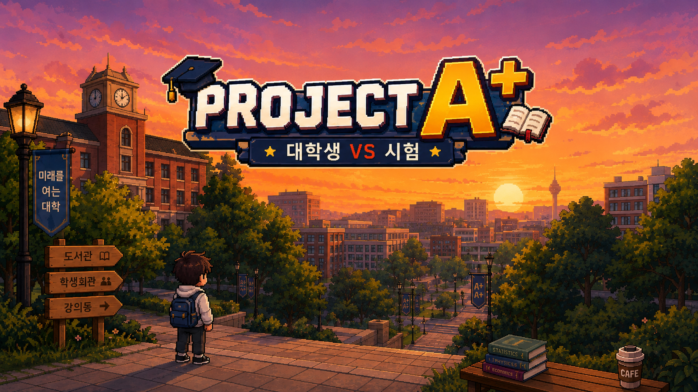
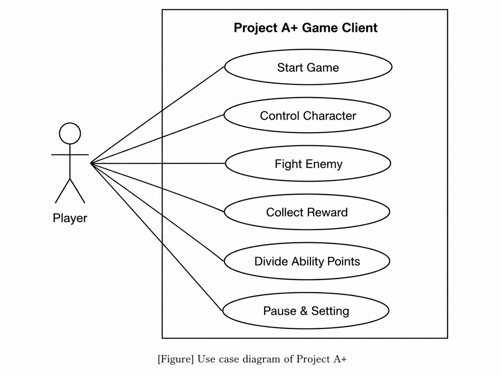
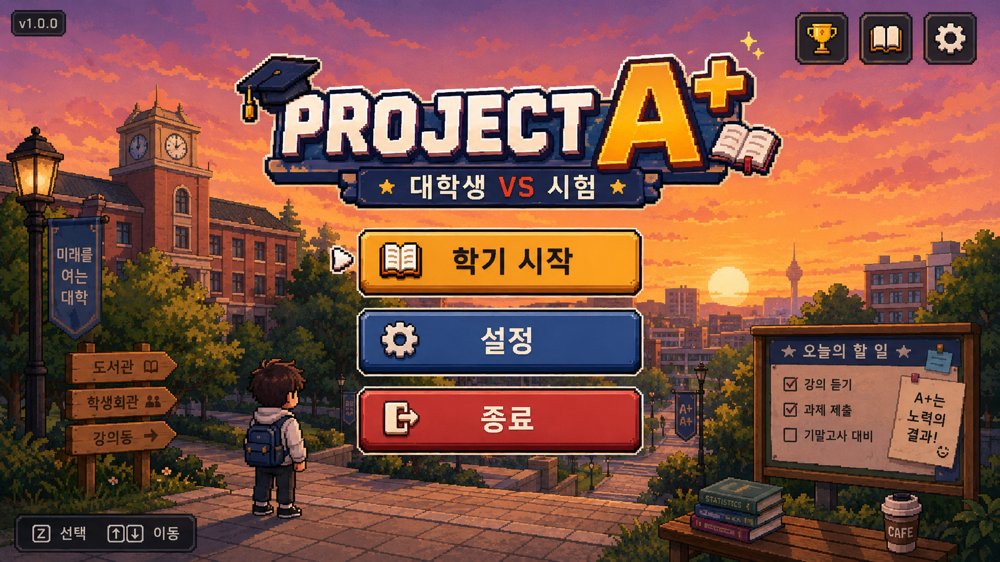
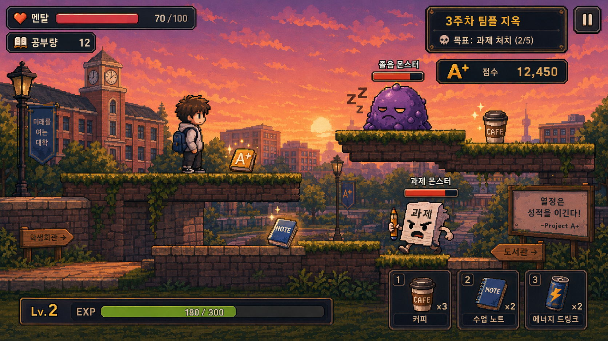
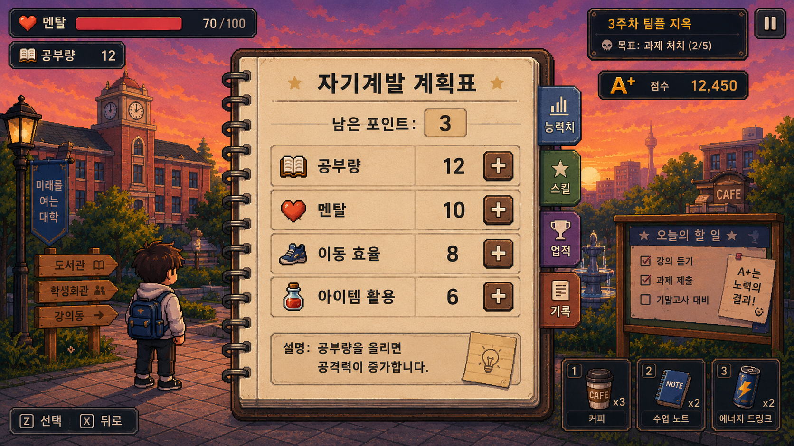
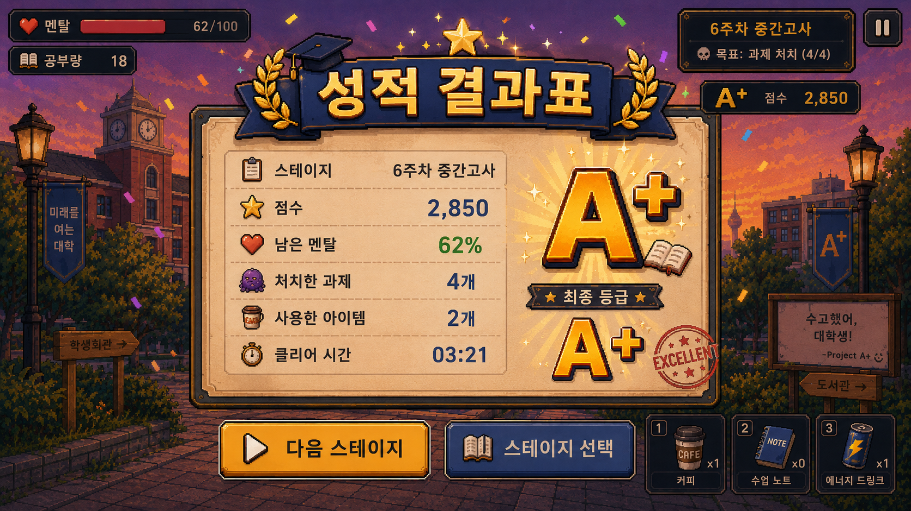
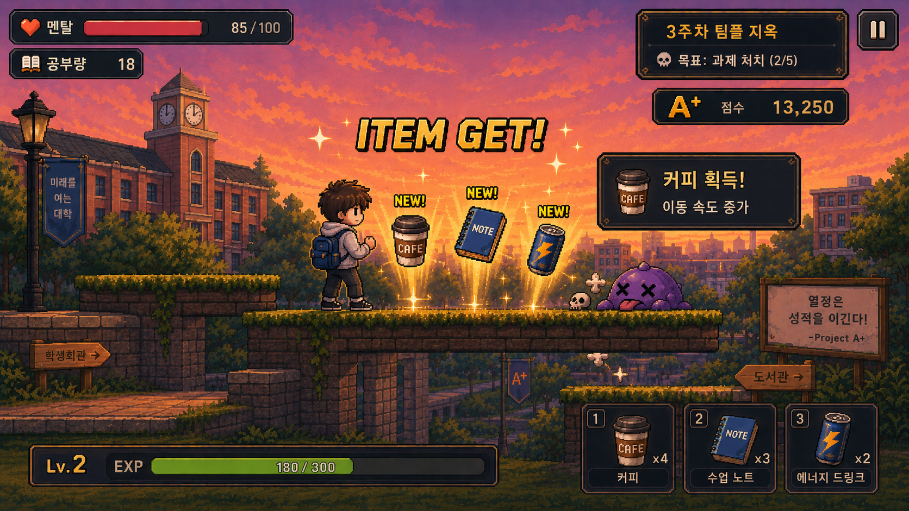
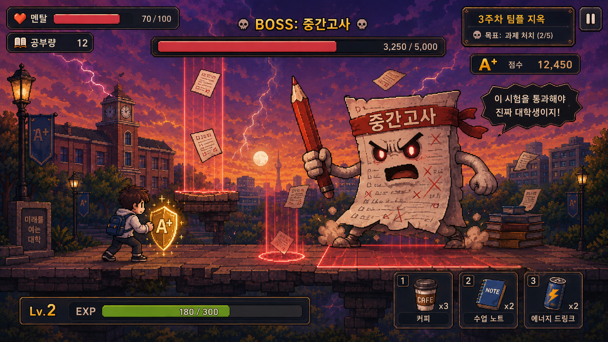
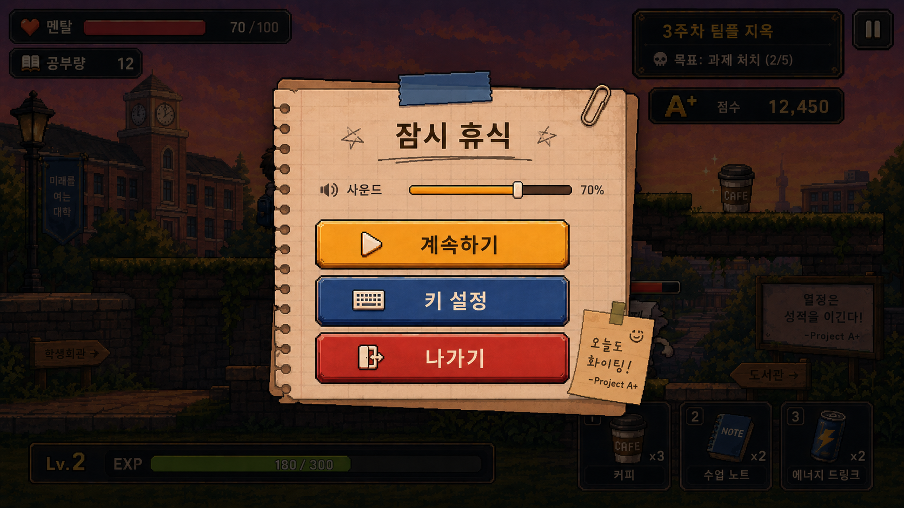

**2. Analysis Phase**

**PROJECT A+**

22313535 류재민

OSS Design - Analysis Document

\[ Revision history \]

| Revision date | Version | Description          | Author |
|---------------|---------|----------------------|--------|
| 2026-05-06    | 0.1     | First Analysis Phase | 류재민 |
| 2026-05-07    | 0.2     | fix almost contents  | 류재민 |
| 2026-05-08    | 1.0     | last fix contents    | 류재민 |
|               |         |                      |        |

**= Contents =**

1\. Introduction ⋯⋯⋯⋯⋯⋯⋯⋯⋯⋯⋯⋯⋯⋯⋯⋯⋯⋯⋯⋯⋯⋯⋯

2\. Use case analysis ⋯⋯⋯⋯⋯⋯⋯⋯⋯⋯⋯⋯⋯⋯⋯⋯⋯⋯⋯⋯

3\. Domain analysis ⋯⋯⋯⋯⋯⋯⋯⋯⋯⋯⋯⋯⋯⋯⋯⋯⋯⋯⋯⋯⋯

4\. User Interface prototype ⋯⋯⋯⋯⋯⋯⋯⋯⋯⋯⋯⋯⋯⋯⋯⋯⋯

5\. Glossary ⋯⋯⋯⋯⋯⋯⋯⋯⋯⋯⋯⋯⋯⋯⋯⋯⋯⋯⋯⋯⋯⋯⋯⋯

6\. References ⋯⋯⋯⋯⋯⋯⋯⋯⋯⋯⋯⋯⋯⋯⋯⋯⋯⋯⋯⋯⋯⋯⋯

**1. Introduction**

**1. Summary**

“Project A+”는 대학생이 한 학기 동안 겪는 학업 과정을 2D 액션 플랫포머
방식으로 표현한 게임이다. 플레이어는 수업, 과제, 시험으로 이어지는 학기
흐름 속에서 스테이지를 진행하며, 학업 부담을 상징하는 적과 장애물을 직접
극복하게 된다.

이 게임은 단순히 대학 생활을 배경으로 사용하는 것이 아니라, 대학생이
실제로 느끼는 성적 압박과 과제 스트레스를 게임의 핵심 구조로 연결한다.
공부량은 공격 능력, 멘탈은 체력, 경험치와 아이템은 성장 자원으로
표현되며, 최종 목표는 한 학기를 성공적으로 마치고 A+를 얻는 것이다.

**2. Introduce “Project A+”**

이번에 제작할 “Project A+”는 Unity 기반의 2D 액션 플랫포머 게임이다.
플레이어는 학기 시작과 함께 캐릭터를 조작하여 각 스테이지를 진행하고,
일반 몬스터, 과제 몬스터, 중간고사 및 기말고사 보스를 상대한다.
스테이지를 클리어하는 과정에서 경험치와 아이템을 획득하고, 이를 활용해
캐릭터의 능력치를 강화할 수 있다.

게임의 주요 특징은 대학 생활의 요소를 게임 시스템에 맞게 변형한 점이다.
수업은 스테이지, 과제는 강한 적, 시험은 보스전, 성적은 최종 평가 결과로
구성된다. 이를 통해 플레이어는 현실의 학업 과정을 게임 속 도전과
보상으로 경험하게 된다.

**3. Goal**

이번 Analysis 보고서에서는 “Project A+”의 기능 흐름을 분석하기 위해 Use
case analysis를 작성하고, 게임 시스템을 구성하는 주요 객체를 Domain
analysis로 정리한다. 또한 플레이어가 실제로 보게 될 화면 구성을 User
Interface prototype을 통해 설명한다.

해당 보고서를 통해 “Project A+”가 어떤 기능을 제공하는지, 플레이어의
행동이 시스템 안에서 어떻게 처리되는지, 그리고 각 기능과 클래스가 게임
진행에 어떤 역할을 하는지 이해할 수 있다.

2\. Use case analysis

1\. Use case diagram

Player 입장에서 Project A+ Game Client가 제공하는 기능을 중심으로 Use
case diagram을 작성하였다. 본 프로젝트는 별도의 게임 서버를 사용하지
않는 로컬 기반 2D 플랫포머 게임이므로, 시스템 외부에서 직접 상호작용하는
Actor는 Player 하나로 설정하였다. Unity Engine, Input System, UI Manager
등은 게임 클라이언트 내부에서 동작하는 구성 요소이기 때문에 Actor로
분리하지 않았다.

Player의 행동은 세부 입력 단위가 아니라 사용자가 하나의 기능으로 인식할
수 있는 단위로 정리하였다. 따라서 좌우 이동과 점프는 Control Character에
포함하였고, 아이템 사용은 전투 및 보상 획득 과정의 세부 흐름으로 보았다.
이러한 기준에 따라 Start Game, Control Character, Fight Enemy, Collect
Reward, Divide Ability Points, Pause & Setting을 주요 Use case로
설정하였다.

2\. Use case description

# **Use case \#1 : Start Game**

**GENERAL CHARACTERISTICS**

| **Item**               | **Description**                                                       |
|------------------------|-----------------------------------------------------------------------|
| Summary                | Player가 게임을 실행한 뒤 Project A+의 학기 진행을 시작하기 위한 기능 |
| Scope                  | Project A+                                                            |
| Level                  | User level                                                            |
| Author                 | 류재민                                                                |
| Last Update            | 2026-05-07                                                            |
| Status                 | Analysis                                                              |
| Primary Actor          | Player                                                                |
| Preconditions          | Player가 게임을 실행하여 메인 타이틀 화면에 진입한 상태여야 한다.     |
| Trigger                | Player가 메인 화면에서 학기 시작 버튼을 누르려고 할 경우              |
| Success Post Condition | Player가 스테이지 선택 화면 또는 첫 번째 게임 스테이지로 이동한다.    |
| Failed Post Condition  | 게임 데이터 또는 씬 로드에 문제가 생겨 게임을 시작하지 못한다.        |

**MAIN SUCCESS SCENARIO**

| **Step** | **Action**                                                      |
|----------|-----------------------------------------------------------------|
| S        | Player가 Project A+의 학기 진행을 시작한다.                     |
| 1        | 이 Use case는 Player가 메인 타이틀 화면에 진입했을 때 시작된다. |
| 2        | Player는 학기 시작 버튼을 누른다.                               |
| 3        | 시스템은 게임 진행에 필요한 기본 데이터를 불러온다.             |
| 4        | 시스템은 Player의 초기 상태와 스테이지 정보를 설정한다.         |
| 5        | 이 Use case는 Player가 게임 진행 화면으로 이동하면 끝난다.      |

**EXTENSION SCENARIOS**

<table>
<colgroup>
<col style="width: 50%" />
<col style="width: 50%" />
</colgroup>
<thead>
<tr class="header">
<th><strong>Step</strong></th>
<th><strong>Branching Action</strong></th>
</tr>
<tr class="odd">
<th>3</th>
<th>3a. 게임 데이터가 존재하지 않는 경우 새 데이터를 생성한다. 
...3a1. 시스템은 기본 Player 정보를 생성한다. 
...3a2. 시스템은 첫 번째 스테이지 정보를 불러온다.</th>
</tr>
<tr class="header">
<th>4</th>
<th>4a. 씬 로드에 실패한 경우 게임 시작에 실패한다. 
...4a1. 시스템은 오류 메시지를 보여준다. 
...4a2. Player를 메인 타이틀 화면으로 되돌린다.</th>
</tr>
</thead>
<tbody>
</tbody>
</table>

**RELATED INFORMATION**

| **Item**    | **Description**               |
|-------------|-------------------------------|
| Performance | \< 10 Seconds                 |
| Frequency   | Player가 게임을 시작할 때마다 |
| Concurrency | None                          |
| Due Date    | 2026-05-07                    |

# **Use case \#2 : Control Character**

**GENERAL CHARACTERISTICS**

| **Item**               | **Description**                                                                 |
|------------------------|---------------------------------------------------------------------------------|
| Summary                | Player가 캐릭터를 이동, 점프, 회피시켜 스테이지를 진행하기 위한 기능            |
| Scope                  | Project A+                                                                      |
| Level                  | User level                                                                      |
| Author                 | 류재민                                                                          |
| Last Update            | 2026-05-07                                                                      |
| Status                 | Analysis                                                                        |
| Primary Actor          | Player                                                                          |
| Preconditions          | Player가 게임 스테이지에 진입해 있고 조작 가능한 캐릭터가 생성된 상태여야 한다. |
| Trigger                | Player가 이동 키나 점프 키를 입력하려고 할 경우                                 |
| Success Post Condition | 캐릭터가 Player의 입력에 따라 정상적으로 움직인다.                              |
| Failed Post Condition  | 캐릭터가 생성되지 않았거나 조작 불가능한 상태라 입력이 반영되지 않는다.         |

**MAIN SUCCESS SCENARIO**

| **Step** | **Action**                                                              |
|----------|-------------------------------------------------------------------------|
| S        | Player가 스테이지를 진행하기 위해 캐릭터를 조작한다.                    |
| 1        | 이 Use case는 Player가 게임 스테이지에 진입했을 때 시작된다.            |
| 2        | Player는 좌우 이동 키를 입력한다.                                       |
| 3        | 시스템은 입력 방향에 따라 캐릭터를 이동시킨다.                          |
| 4        | Player는 장애물을 넘기 위해 점프 키를 입력한다.                         |
| 5        | 시스템은 캐릭터가 점프 가능한 상태인지 확인한다.                        |
| 6        | 캐릭터가 점프 가능한 상태라면 시스템은 캐릭터를 점프시킨다.             |
| 7        | 이 Use case는 캐릭터가 Player의 입력에 따라 정상적으로 움직이면 끝난다. |

**EXTENSION SCENARIOS**

<table>
<colgroup>
<col style="width: 50%" />
<col style="width: 50%" />
</colgroup>
<thead>
<tr class="header">
<th><strong>Step</strong></th>
<th><strong>Branching Action</strong></th>
</tr>
<tr class="odd">
<th>5</th>
<th>5a. 캐릭터가 공중에 있는 경우 점프 입력을 제한한다. 
...5a1. 시스템은 추가 점프를 실행하지 않는다. 
...5a2. Player는 착지 후 다시 점프할 수 있다.</th>
</tr>
<tr class="header">
<th>3</th>
<th>3a. 캐릭터가 피격 또는 사망 상태인 경우 이동 입력을 제한한다. 
...3a1. 시스템은 조작할 수 없는 상태라는 피드백을 출력한다. 
...3a2. 상태가 회복되면 다시 입력을 받을 수 있도록 한다.</th>
</tr>
</thead>
<tbody>
</tbody>
</table>

**RELATED INFORMATION**

| **Item**    | **Description**           |
|-------------|---------------------------|
| Performance | \< 0.1 Seconds            |
| Frequency   | 게임 플레이 중 지속적으로 |
| Concurrency | None                      |
| Due Date    | 2026-05-07                |

# **Use case \#3 : Fight Enemy**

**GENERAL CHARACTERISTICS**

| **Item**               | **Description**                                                          |
|------------------------|--------------------------------------------------------------------------|
| Summary                | Player가 일반 몬스터, 과제 몬스터, 시험 보스와 전투하기 위한 기능        |
| Scope                  | Project A+                                                               |
| Level                  | User level                                                               |
| Author                 | 류재민                                                                   |
| Last Update            | 2026-05-07                                                               |
| Status                 | Analysis                                                                 |
| Primary Actor          | Player                                                                   |
| Preconditions          | Player가 전투 가능한 스테이지에 있고 캐릭터가 행동 가능한 상태여야 한다. |
| Trigger                | Player가 적을 발견하고 공격을 시도할 경우                                |
| Success Post Condition | 적의 체력이 감소하거나 적이 처치된다.                                    |
| Failed Post Condition  | 공격이 적에게 적용되지 않거나 Player의 멘탈이 0이 되어 전투에 실패한다.  |

**MAIN SUCCESS SCENARIO**

| **Step** | **Action**                                                          |
|----------|---------------------------------------------------------------------|
| S        | Player가 스테이지에서 적과 전투를 시작한다.                         |
| 1        | 이 Use case는 Player가 적의 행동 범위에 들어갔을 때 시작된다.       |
| 2        | 시스템은 적의 상태와 공격 패턴을 활성화한다.                        |
| 3        | Player는 적을 공격하기 위해 공격 키를 입력한다.                     |
| 4        | 시스템은 Player의 공격 범위와 적의 위치를 확인한다.                 |
| 5        | 공격이 적에게 닿았다면 시스템은 적의 체력을 감소시킨다.             |
| 6        | 적의 체력이 0 이하가 되면 시스템은 적을 처치 상태로 전환한다.       |
| 7        | 이 Use case는 적이 처치되거나 Player가 전투 구간을 벗어나면 끝난다. |

**EXTENSION SCENARIOS**

<table>
<colgroup>
<col style="width: 50%" />
<col style="width: 50%" />
</colgroup>
<thead>
<tr class="header">
<th><strong>Step</strong></th>
<th><strong>Branching Action</strong></th>
</tr>
<tr class="odd">
<th>4</th>
<th>4a. Player의 공격이 적에게 닿지 않은 경우 공격은 실패한다. 
...4a1. 시스템은 적의 체력을 감소시키지 않는다. 
...4a2. Player는 다시 공격을 시도할 수 있다.</th>
</tr>
<tr class="header">
<th>5</th>
<th>5a. Player가 적의 공격에 맞은 경우 멘탈 수치가 감소한다. 
...5a1. 시스템은 Player의 멘탈 UI를 갱신한다. 
...5a2. 멘탈이 0 이하가 되면 실패 화면을 출력한다.</th>
</tr>
<tr class="odd">
<th>3</th>
<th>3a. Player가 아이템을 사용하는 경우 보유 아이템을 확인한다. 
...3a1. 아이템이 존재하면 회복 또는 강화 효과를 적용한다. 
...3a2. 아이템이 없으면 사용 실패 메시지를 보여준다.</th>
</tr>
</thead>
<tbody>
</tbody>
</table>

**RELATED INFORMATION**

| **Item**    | **Description**           |
|-------------|---------------------------|
| Performance | \< 0.2 Seconds            |
| Frequency   | Player가 적과 만날 때마다 |
| Concurrency | None                      |
| Due Date    | 2026-05-07                |

# **Use case \#4 : Collect Reward**

**GENERAL CHARACTERISTICS**

| **Item**               | **Description**                                                                    |
|------------------------|------------------------------------------------------------------------------------|
| Summary                | Player가 적 처치 또는 스테이지 클리어 후 경험치, 아이템, 점수를 획득하기 위한 기능 |
| Scope                  | Project A+                                                                         |
| Level                  | User level                                                                         |
| Author                 | 류재민                                                                             |
| Last Update            | 2026-05-07                                                                         |
| Status                 | Analysis                                                                           |
| Primary Actor          | Player                                                                             |
| Preconditions          | 적이 처치되었거나 스테이지 클리어 조건이 만족된 상태여야 한다.                     |
| Trigger                | Player가 보상 오브젝트에 접근하거나 결과 화면을 확인할 경우                        |
| Success Post Condition | 경험치, 아이템, 점수가 Player 데이터에 정상적으로 반영된다.                        |
| Failed Post Condition  | 보상 데이터가 누락되거나 UI에 잘못 표시된다.                                       |

**MAIN SUCCESS SCENARIO**

| **Step** | **Action**                                                         |
|----------|--------------------------------------------------------------------|
| S        | Player가 전투 또는 스테이지 클리어 후 보상을 획득한다.             |
| 1        | 이 Use case는 적이 처치되거나 스테이지가 클리어되었을 때 시작된다. |
| 2        | 시스템은 획득 가능한 보상 정보를 생성한다.                         |
| 3        | Player는 보상 오브젝트에 접근하거나 결과 화면을 확인한다.          |
| 4        | 시스템은 Player가 획득 조건을 만족했는지 확인한다.                 |
| 5        | 시스템은 경험치, 아이템, 점수를 Player 데이터에 추가한다.          |
| 6        | 시스템은 획득한 보상 내용을 UI에 표시한다.                         |
| 7        | 이 Use case는 보상 정보가 정상적으로 반영되면 끝난다.              |

**EXTENSION SCENARIOS**

<table>
<colgroup>
<col style="width: 50%" />
<col style="width: 50%" />
</colgroup>
<thead>
<tr class="header">
<th><strong>Step</strong></th>
<th><strong>Branching Action</strong></th>
</tr>
<tr class="odd">
<th>4</th>
<th>4a. Player가 보상 획득 범위 밖에 있는 경우 보상을 즉시 획득하지
않는다. 
...4a1. 시스템은 보상 오브젝트를 유지한다. 
...4a2. Player가 다시 접근하면 획득을 시도한다.</th>
</tr>
<tr class="header">
<th>5</th>
<th>5a. 인벤토리가 가득 찬 경우 아이템 획득에 실패한다. 
...5a1. 시스템은 인벤토리 부족 메시지를 출력한다. 
...5a2. 경험치와 점수는 정상적으로 지급한다.</th>
</tr>
<tr class="odd">
<th>5</th>
<th>5b. 경험치가 일정 수치 이상이 된 경우 성장 포인트를 지급한다. 
...5b1. 시스템은 레벨 또는 성장 상태를 갱신한다. 
...5b2. 능력치 분배 가능 안내를 표시한다.</th>
</tr>
</thead>
<tbody>
</tbody>
</table>

**RELATED INFORMATION**

| **Item**    | **Description**                     |
|-------------|-------------------------------------|
| Performance | \< 1 Second                         |
| Frequency   | 적 처치 또는 스테이지 클리어 때마다 |
| Concurrency | None                                |
| Due Date    | 2026-05-07                          |

# **Use case \#5 : Divide Ability Points**

**GENERAL CHARACTERISTICS**

| **Item**               | **Description**                                                           |
|------------------------|---------------------------------------------------------------------------|
| Summary                | Player가 획득한 성장 포인트를 공부량, 멘탈 등 능력치에 분배하기 위한 기능 |
| Scope                  | Project A+                                                                |
| Level                  | User level                                                                |
| Author                 | 류재민                                                                    |
| Last Update            | 2026-05-07                                                                |
| Status                 | Analysis                                                                  |
| Primary Actor          | Player                                                                    |
| Preconditions          | Player가 성장 포인트를 보유하고 있어야 한다.                              |
| Trigger                | Player가 능력치 분배 화면을 열고 포인트를 사용하려고 할 경우              |
| Success Post Condition | 선택한 능력치가 상승하고 남은 포인트가 감소한다.                          |
| Failed Post Condition  | 포인트가 부족하거나 잘못된 입력으로 인해 능력치가 상승하지 않는다.        |

**MAIN SUCCESS SCENARIO**

| **Step** | **Action**                                                    |
|----------|---------------------------------------------------------------|
| S        | Player가 캐릭터를 성장시키기 위해 능력치를 분배한다.          |
| 1        | 이 Use case는 Player가 능력치 분배 화면을 열었을 때 시작된다. |
| 2        | 시스템은 현재 보유한 성장 포인트와 능력치 정보를 보여준다.    |
| 3        | Player는 공부량, 멘탈, 이동 능력 중 강화할 능력치를 선택한다. |
| 4        | Player는 선택한 능력치에 포인트를 투자한다.                   |
| 5        | 시스템은 보유 포인트가 충분한지 확인한다.                     |
| 6        | 포인트가 충분하면 시스템은 해당 능력치를 상승시킨다.          |
| 7        | 시스템은 남은 포인트와 변경된 능력치를 UI에 갱신한다.         |
| 8        | 이 Use case는 능력치 변경 내용이 정상적으로 반영되면 끝난다.  |

**EXTENSION SCENARIOS**

<table>
<colgroup>
<col style="width: 50%" />
<col style="width: 50%" />
</colgroup>
<thead>
<tr class="header">
<th><strong>Step</strong></th>
<th><strong>Branching Action</strong></th>
</tr>
<tr class="odd">
<th>5</th>
<th>5a. 보유 포인트가 부족한 경우 능력치 분배에 실패한다. 
...5a1. 시스템은 포인트 부족 메시지를 보여준다. 
...5a2. 능력치 수치는 변경하지 않는다.</th>
</tr>
<tr class="header">
<th>4</th>
<th>4a. Player가 잘못된 항목을 선택한 경우 입력을 무시한다. 
...4a1. 시스템은 선택 가능한 능력치 항목만 활성화한다.</th>
</tr>
<tr class="odd">
<th>7</th>
<th>7a. Player가 분배를 취소한 경우 변경 내용을 적용하지 않는다. 
...7a1. 시스템은 이전 능력치 상태로 되돌린다.</th>
</tr>
</thead>
<tbody>
</tbody>
</table>

**RELATED INFORMATION**

| **Item**    | **Description**                    |
|-------------|------------------------------------|
| Performance | \< 1 Second                        |
| Frequency   | Player가 성장 포인트를 획득한 이후 |
| Concurrency | None                               |
| Due Date    | 2026-05-07                         |

# **Use case \#6 : Pause & Setting**

**GENERAL CHARACTERISTICS**

| **Item**               | **Description**                                                           |
|------------------------|---------------------------------------------------------------------------|
| Summary                | Player가 게임을 일시정지하고 사운드, 조작, 화면 설정을 변경하기 위한 기능 |
| Scope                  | Project A+                                                                |
| Level                  | User level                                                                |
| Author                 | 류재민                                                                    |
| Last Update            | 2026-05-07                                                                |
| Status                 | Analysis                                                                  |
| Primary Actor          | Player                                                                    |
| Preconditions          | Player가 게임 진행 중이어야 한다.                                         |
| Trigger                | Player가 ESC 키 또는 일시정지 버튼을 입력할 경우                          |
| Success Post Condition | 게임이 일시정지되고 설정 변경 사항이 적용된다.                            |
| Failed Post Condition  | 일시정지가 적용되지 않거나 설정 변경 사항이 저장되지 않는다.              |

**MAIN SUCCESS SCENARIO**

| **Step** | **Action**                                                         |
|----------|--------------------------------------------------------------------|
| S        | Player가 게임을 잠시 멈추거나 설정을 변경하려고 할 때 시작된다.    |
| 1        | 이 Use case는 Player가 게임 진행 중 ESC 키를 입력했을 때 시작된다. |
| 2        | 시스템은 게임 진행을 일시정지한다.                                 |
| 3        | 시스템은 Pause & Setting UI를 화면에 출력한다.                     |
| 4        | Player는 사운드, 조작 키, 화면 설정 중 변경할 항목을 선택한다.     |
| 5        | Player는 원하는 설정값으로 변경한다.                               |
| 6        | 시스템은 변경된 설정값을 적용한다.                                 |
| 7        | Player가 돌아가기 버튼을 누르면 시스템은 게임을 재개한다.          |
| 8        | 이 Use case는 게임이 정상적으로 재개되면 끝난다.                   |

**EXTENSION SCENARIOS**

<table>
<colgroup>
<col style="width: 50%" />
<col style="width: 50%" />
</colgroup>
<thead>
<tr class="header">
<th><strong>Step</strong></th>
<th><strong>Branching Action</strong></th>
</tr>
<tr class="odd">
<th>4</th>
<th>4a. Player가 설정을 변경하지 않고 돌아가기를 선택한다. 
...4a1. 시스템은 기존 설정값을 유지한다. 
...4a2. 게임을 다시 진행 상태로 전환한다.</th>
</tr>
<tr class="header">
<th>5</th>
<th>5a. 잘못된 키 입력 또는 적용 불가능한 설정값이 입력된다. 
...5a1. 시스템은 설정값을 적용하지 않는다. 
...5a2. Player에게 다시 입력하라는 안내를 출력한다.</th>
</tr>
<tr class="odd">
<th>6</th>
<th>6a. 설정 저장에 실패한 경우 기본 설정을 유지한다. 
...6a1. 시스템은 저장 실패 메시지를 출력한다. 
...6a2. Player는 다시 설정을 변경할 수 있다.</th>
</tr>
</thead>
<tbody>
</tbody>
</table>

**RELATED INFORMATION**

| **Item**    | **Description**                   |
|-------------|-----------------------------------|
| Performance | \< 1 Second                       |
| Frequency   | Player가 게임을 일시정지할 때마다 |
| Concurrency | None                              |
| Due Date    | 2026-05-07                        |

## **3. Domain analysis**

1.  **PlayerController  
    ** 플레이어 캐릭터의 조작을 담당하는 클래스이다. 좌우 이동, 점프,
    회피와 같은 기본 조작 정보를 처리하며, 플레이어가 현재 이동 가능한
    상태인지 판단한다. 피격 중이거나 일시정지 상태일 경우 입력을
    제한하고, 정상 상태일 경우 입력값에 따라 캐릭터의 움직임을 갱신한다.

2.  **PlayerStatus  
    ** 플레이어의 능력치와 현재 상태를 관리하는 클래스이다. Project
    A+에서는 일반적인 체력이나 공격력 대신 ‘멘탈(hp)’, ‘공부량(atk)’, 와
    같은 학업 테마의 수치를 사용한다. 전투 중 피해를 받으면 멘탈 수치가
    감소하고, 스탯을통해 공부량을 증가시킬수있다.

3.  **AbilityManager  
    ** 플레이어가 획득한 성장 포인트를 능력치에 분배하는 기능을 담당하는
    클래스이다. 플레이어는 공부량, 멘탈, 이동 능력 등의 항목에 포인트를
    투자할 수 있으며, 이 클래스는 포인트가 충분한지 확인하고 변경된
    능력치를 PlayerStatus에 반영한다.

4.  **StageManager  
    ** 게임의 스테이지 진행을 관리하는 클래스이다. Project A+는 한
    학기의 흐름을 여러 수업 스테이지로 구성하기 때문에, 현재 스테이지
    번호, 클리어 조건, 다음 스테이지 이동 등을 관리한다. 일반 스테이지,
    과제 몬스터 구간, 시험 보스 구간의 진행 상태를 판단하는 역할을 한다.

5.  **EnemyController  
    ** 스테이지에 등장하는 적 오브젝트의 행동을 관리하는 클래스이다.
    일반 몬스터, 과제 몬스터, 시험 보스의 이동 방식과 공격 패턴을
    처리한다. 적이 플레이어를 감지했을 때 공격을 시작하고, 체력이 0
    이하가 되면 처치 상태로 전환한다.

6.  **BattleManager  
    ** 플레이어와 적 사이의 전투 흐름을 관리하는 클래스이다. 플레이어의
    공격이 적에게 닿았는지, 적의 공격이 플레이어에게 적용되었는지
    판단한다. 또한 전투 결과에 따라 적의 체력 감소, 플레이어의 멘탈
    감소, 보상 생성 등의 처리를 연결한다.

7.  **RewardManager  
    ** 전투 또는 스테이지 클리어 이후 지급되는 보상을 관리하는
    클래스이다. 적을 처치하거나 스테이지를 완료했을 때 경험치, 아이템,
    점수 보상을 생성하고 PlayerStatus에 반영한다. 경험치가 일정 수치
    이상이 되면 성장 포인트를 지급하여 능력치 분배가 가능하도록 한다.

8.  **Item  
    ** 플레이어가 획득하거나 사용할 수 있는 아이템 정보를 가지는
    클래스이다. 아이템은 멘탈 회복, 일시적인 공부량 증가, 이동 능력 강화
    등 플레이어에게 유리한 효과를 제공한다. 아이템의 종류, 효과, 지속
    시간, 사용 가능 여부 등의 정보를 저장한다.

9.  **GameManager  
    ** 게임 전체 흐름을 관리하는 클래스이다. 게임 시작, 일시정지,
    재시작, 실패 처리, 스테이지 전환 등 전체 상태를 제어한다. Player가
    학기 시작 버튼을 누르면 게임을 초기화하고, 멘탈이 0 이하가 되거나
    스테이지를 모두 클리어하면 결과 화면으로 전환한다.

10. **UIManager  
    ** 플레이어에게 필요한 정보를 화면에 표시하는 클래스이다. 현재 멘탈,
    공부량, 경험치, 보유 성장 포인트, 현재 스테이지, 아이템 정보 등을
    UI로 출력한다. 또한 Pause & Setting 화면, 능력치 분배 화면, 보상
    획득 안내, 실패 및 클리어 화면을 표시한다.

11. **SettingManager  
    ** 게임 설정 정보를 관리하는 클래스이다. 사운드 크기, 조작 키, 화면
    설정과 같은 사용자 환경 설정을 저장하고 적용한다. Player가 Pause &
    Setting 기능을 사용할 때 설정값을 변경하면, 해당 값을 게임에
    반영하고 이후에도 사용할 수 있도록 관리한다.

12. **SaveDataManager  
    ** 플레이어의 진행 상황을 저장하고 불러오는 클래스이다. 현재
    스테이지, 플레이어 능력치, 경험치, 보유 아이템, 설정값 등을
    저장한다. 게임을 다시 실행했을 때 이전 진행 정보를 불러오거나, 저장
    데이터가 없을 경우 기본 데이터를 생성한다.

4\. User Interface prototype

1\. Main Title Screen

플레이어가 게임을 처음 실행했을 때 보이는 메인 화면이다. 화면 중앙에는
아래에는 **학기 시작, 설정, 종료** 버튼이 배치되어 있으며, 플레이어는 이
화면에서 게임을 시작하거나 환경 설정을 변경할 수 있다.

2\. Game Play Screen

플레이어가 실제 스테이지를 진행하는 화면이다. 왼쪽 상단에는 현재
**멘탈**과 **공부량**이 표시되고, 오른쪽 상단에는 현재 주차와 목표, 점수
정보가 표시된다. 화면 하단에는 경험치 바와 아이템 슬롯이 배치되어 있어
플레이어가 자신의 상태를 실시간으로 확인하며 스테이지를 진행할 수 있다.

3\. Ability Point Screen

플레이어가 획득한 포인트를 능력치에 분배하는 화면이다. 중앙의 자기계발
계획표에는 **공부량**, **멘탈**, **이동 효율**, **아이템 활용** 능력치가
표시된다. 플레이어는 남은 포인트를 원하는 능력치에 투자하여 캐릭터를
성장시킬 수 있다.

4\. Result Screen

스테이지를 클리어한 뒤 결과를 보여주는 화면이다. 화면 중앙에는 성적
결과표가 표시되며, 점수, 남은 멘탈, 처치한 과제 수, 사용한 아이템,
클리어 시간이 정리된다. 최종 등급은 A+, A, B+와 같은 학점 형태로
표현되어 게임의 목표와 대학 생활 테마를 연결한다.

5\. Item Reward Screen

플레이어가 전투 후 아이템을 획득했을 때 표시되는 화면이다. 화면 중앙에는
**ITEM GET!** 문구와 함께 획득한 아이템이 강조되어 나타난다. 획득한
아이템은 하단 아이템 슬롯에 추가되며, 이후 전투나 스테이지 진행 중
사용할 수 있다.

6\. Boss Battle Screen

중간고사 또는 기말고사와 같은 보스전이 진행되는 화면이다. 화면 상단에는
보스 이름과 체력 바가 크게 표시되며, 플레이어는 보스의 공격 패턴을
피하면서 전투를 진행한다. 보스전은 일반 스테이지보다 긴장감을 높이는
핵심 전투 구간으로 구성된다.

7\. Pause & Setting Screen

플레이어가 게임 진행 중 일시정지 버튼을 눌렀을 때 나타나는 화면이다.
배경은 어둡게 처리되고, 중앙에는 잠시 휴식 메뉴가 표시된다. 플레이어는
이 화면에서 게임을 계속하거나, 키 설정을 변경하거나, 게임을 나갈 수
있다. 

5\. Glossary

| **Term**         | **Description**                                                                                            |
|------------------|------------------------------------------------------------------------------------------------------------|
| Project A+       | 본 프로젝트의 게임 제목이다. 대학생의 한 학기 과정을 2D 액션 플랫포머 방식으로 표현한 게임이다.            |
| Player           | 게임을 직접 조작하는 사용자이다. 캐릭터를 움직이고, 적과 전투하며, 스테이지를 클리어하는 주체이다.         |
| Game Client      | Player가 실행하는 게임 프로그램이다. 게임 시작, 캐릭터 조작, 전투, 보상, UI 출력 등의 기능을 제공한다.     |
| 2D Platformer    | 캐릭터가 좌우로 이동하고 점프하며 스테이지를 진행하는 게임 장르이다. Project A+의 기본 플레이 방식이다.    |
| Stage            | Player가 진행하는 게임 구간이다. Project A+에서는 대학 수업의 주차 단위로 표현된다.                        |
| 학기             | 게임 전체 진행 흐름을 의미한다. 여러 개의 스테이지를 클리어하며 최종적으로 A+를 목표로 한다.               |
| 수업             | 일반 스테이지를 의미한다. Player가 기본 적과 장애물을 통과하며 진행하는 구간이다.                          |
| 과제 몬스터      | 대학 생활의 과제를 적 캐릭터로 표현한 오브젝트이다. 일반 몬스터보다 강한 적으로 등장할 수 있다.            |
| 시험 보스        | 중간고사 또는 기말고사를 상징하는 보스 캐릭터이다. 스테이지의 중요한 전투 구간에서 등장한다.               |
| 멘탈             | Player의 체력에 해당하는 능력치이다. 적에게 공격받으면 감소하며, 0이 되면 스테이지 진행에 실패한다.        |
| 공부량           | Player의 공격 능력에 해당하는 수치이다. 공부량이 높을수록 적에게 더 큰 피해를 줄 수 있다.                  |
| 경험치           | 적 처치나 스테이지 클리어를 통해 얻는 성장 자원이다. 일정 수치 이상 모이면 성장 포인트를 획득할 수 있다.   |
| 성장 포인트      | 능력치 분배에 사용하는 포인트이다. Player는 이를 공부량, 멘탈, 이동 효율 등 원하는 항목에 투자할 수 있다.  |
| 능력치 분배      | Player가 성장 포인트를 사용하여 캐릭터의 능력치를 강화하는 기능이다.                                       |
| 아이템           | Player가 스테이지 진행 중 획득하거나 사용할 수 있는 오브젝트이다. 멘탈 회복, 능력 강화 등의 효과를 가진다. |
| 보상             | 전투 승리나 스테이지 클리어 후 지급되는 결과이다. 경험치, 아이템, 점수 등이 포함된다.                      |
| 현재 학점        | Player의 진행 결과를 학점 형태로 보여주는 지표이다. 누적 점수와 클리어 성과에 따라 달라진다.               |
| 누적 점수        | 스테이지 클리어 결과가 합산된 점수이다. 최종 성적 평가에 사용된다.                                         |
| UI               | User Interface의 약자이다. Player에게 멘탈, 공부량, 점수, 아이템, 설정 화면 등을 보여주는 화면 요소이다.   |
| Pause & Setting  | 게임을 일시정지하고 설정을 변경하는 기능이다. 사운드, 조작 키, 화면 설정 등을 조정할 수 있다.              |
| PlayerController | Player 캐릭터의 이동, 점프, 회피 등 조작을 처리하는 클래스이다.                                            |
| PlayerStatus     | Player의 멘탈, 공부량, 경험치, 성장 포인트 등 상태 정보를 관리하는 클래스이다.                             |
| EnemyController  | 일반 몬스터, 과제 몬스터, 시험 보스의 행동과 공격 패턴을 관리하는 클래스이다.                              |
| StageManager     | 현재 스테이지 정보, 클리어 조건, 다음 스테이지 이동을 관리하는 클래스이다.                                 |
| UIManager        | Player에게 필요한 정보를 화면에 표시하고 UI 화면을 관리하는 클래스이다.                                    |

6\. References

1\) Unity Documentation
https://docs.unity3d.com/kr/2023.2/Manual/Glossary.html

2\) image reference

[<u>https://store.steampowered.com/app/1147560/Skul_The_Hero_Slayer/</u>](https://store.steampowered.com/app/1147560/Skul_The_Hero_Slayer/)

3\) Unity Technologies, "Rigidbody2D - Unity Scripting API"

[<u>https://docs.unity3d.com/ScriptReference/Rigidbody2D.html</u>](https://docs.unity3d.com/ScriptReference/Rigidbody2D.html)

4)Unity Technologies, "SceneManager.LoadScene - Unity Scripting API"

https://docs.unity3d.com/ScriptReference/SceneManagement.SceneManager.LoadScene.html

5)Unity Technologies, "Time.timeScale - Unity Scripting API"

https://docs.unity3d.com/ScriptReference/Time-timeScale.html

6)Unity Learn, "2D Platformer Character Controller"

https://learn.unity.com/tutorial/2d-game-kit-reference-guide

7)Game Design Patterns, "Observer Pattern for UI & Stats"

https://gameprogrammingpatterns.com/observer.html

8)나무위키Skul: The Hero Slayer문서

https://namu.wiki/w/Skul:%20The%20Hero%20Slayer
